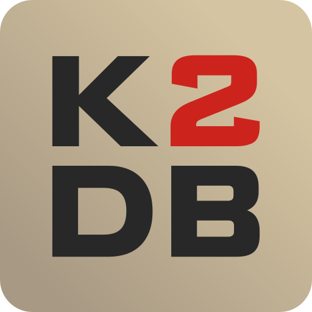

  
  <h1 align="center">KonturDB 2</h1>
  

    Приложение для удобного хранения информации об электронных радиокомпонентах.
     
    <a href="https://github.com/b4siliQ/KonturDB-2/issues">Сообщить об ошибке</a>
    ·
    <a href="https://github.com/b4siliQ/KonturDB-2/releases">Скачать</a>
  

# О проекте

Данный проект распространяется как свободное ПО и разрабатывается на волонтерской основе без определенного финансирования.

## Техстек

## Совместимость с системами

На данный момент приложение официально распространяется для систем Windows и дистрибутивов ядра Linux. Однако так же имеется возможность запуска .jar файлов через JRE 25 и выше.

## Известные баги, ошибки и недочеты

1) Неправильное отображение подсказок кнопок
2) Отсутствие отображения уведомлений об ошибках
3) Сортировка "по избранному" реализована не до конца

## Разработчики

 **[b4siliQ](https://github.com/b4siliQ)** — Главный разработчик проекта  
 **[Wulfe5387](https://github.com/Wulfe5387)** — Крутая поддержка и портировщик для Windows